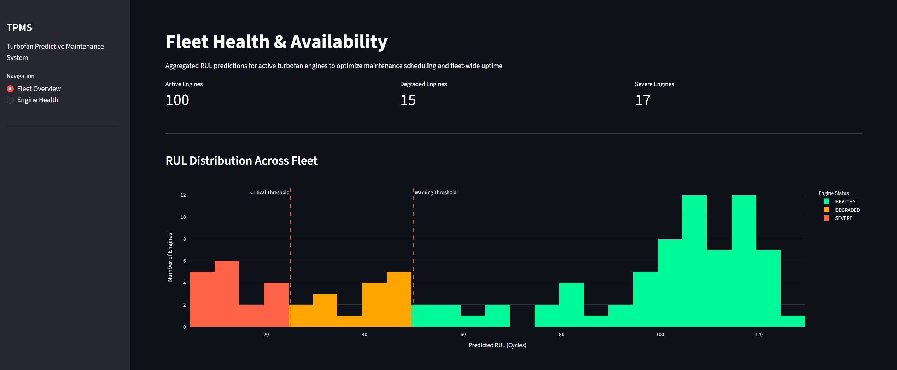
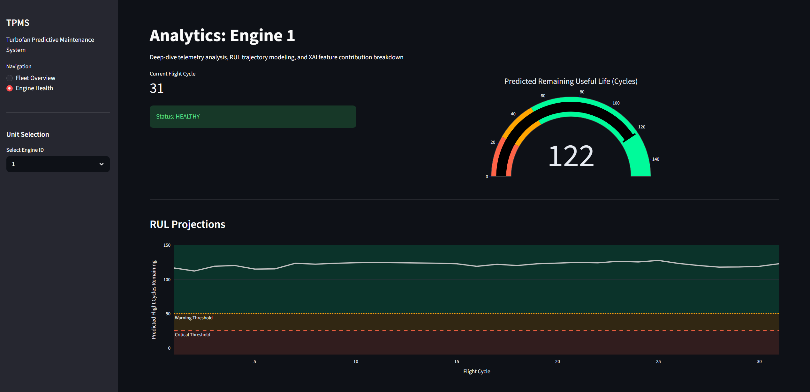
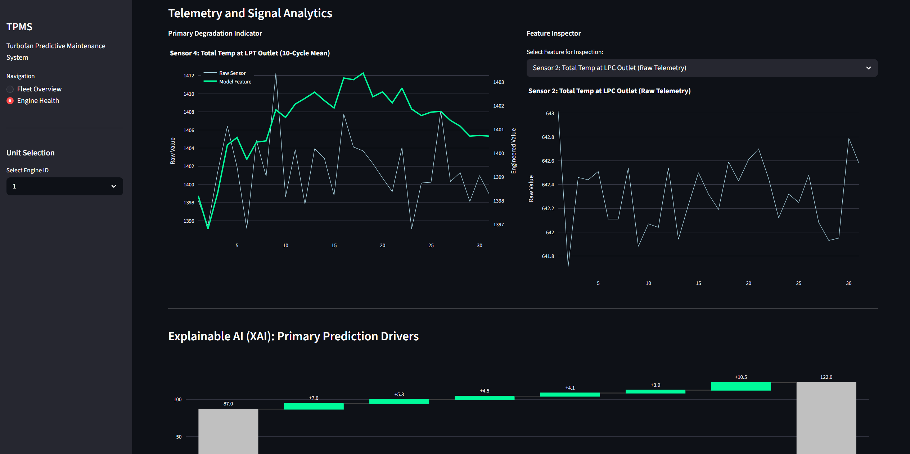

# TPMS: Turbofan Predictive Maintenance System


## Project Overview
This repository implements a containerized Prognostic Health Management (PHM) system to estimate the Remaining Useful Life (RUL) of turbofan engines using the [NASA C-MAPSS (FD001) dataset](https://data.nasa.gov/dataset/cmapss-jet-engine-simulated-data).

The architecture uses a decoupled machine learning lifecycle. A local research environment leverages Optuna for Bayesian hyperparameter optimization and MLflow for experiment tracking. The resulting XGBoost model is deployed in an isolated Docker container, serving a Streamlit inference dashboard that provides fleet-level readiness metrics alongside sensor-level Explainable AI (XAI) analytics using SHAP.

---

## Tech Stack

- Language: Python 3.11
- ML Model: XGBoost (Regression)
- Optimization: Optuna (Bayesian Search)
- Experiment Tracking: MLflow
- UI/UX: Streamlit + Plotly
- Interpretability: SHAP
- Deployment: Docker (slim-python)

---

## Dashboard Interface

*Fleet-wide health distribution and macro-level asset tracking*



*Unit-specific analytics and SHAP waterfall charts showing sensor-level contribution to the RUL prediction*

## Technical Design Decisions

### 1. Decoupled Training & Inference
This project is split to keep the deployment environment simple.
* **Training (`src/models/`):** Uses `MLflow` for tracking and `Optuna` for hyperparameter search. These tools are used locally to generate the model and are not included in the container.
* **Inference (`app/`):** The Streamlit UI loads a frozen Universal Binary JSON (`model.ubj`) weight file. The Docker container uses a separate `requirements-app.txt` to avoid installing training-only libraries.

### 2. Signal Processing (Temporal Features)
The turbofan sensor data is noisy and non-stationary. To extract clearer degradation signals, the pipeline generates rolling window features:
* **Feature Set:** 10 and 20-cycle rolling means (macro-trends) and standard deviations (micro-volatility).
* **Leakage Prevention:** Data is split using `GroupShuffleSplit` on the `engine_id` to ensure temporal windows from the same engine never appear in both the training and validation sets simultaneously.

### 3. Piecewise Linear Target (RUL Clipping)
Engines typically show no measurable wear during early cycles. Training the model to predict a linear decay from the very first cycle leads to high error rates in healthy engines. To solve this, the target RUL is clipped at 125 cycles, allowing the model to focus on the actual degradation curve.

### 4. Local Interpretability (SHAP)
To explain why a unit is failing, the dashboard uses SHAP (SHapley Additive exPlanations). This decomposes the XGBoost prediction into individual sensor contributions, showing exactly which readings (ex. high exhaust gas temp or low pressure) are driving the RUL estimate down compared to the fleet baseline.

---

## Quick Start

The app is containerized for reproducibility. The C-MAPSS test telemetry is included in the repo so the dashboard works out-of-the-box.

**Prerequisites**
- Docker Desktop (Recommended)
- OR Python 3.11+ with ```pip install -r requirements.txt```

### 1. Clone the repository
```
git clone https://github.com/louis-bloechl/turbofan-predictive-maintenance.git
cd turbofan-predictive-maintenance
```

### 2. Deployment (Docker)

#### Build the Docker image
```
docker build -t tpms-app .
```

#### Run the container
Execute the following to map the container's Streamlit port (8501) to your local host:
```
docker run -p 8501:8501 tpms-app
```

#### Access the UI

Open your web browser and navigate to http://localhost:8501

### 3. Research & Development Pipeline

For local development, hyperparameter tuning, or model verification, the following modules should be executed from the project root directory (turbofan-predictive-maintenance/).

#### Environment setup
To initialize the local environment for training and optimization:
```
pip install -r requirements.txt
```

#### Model training and experiment tracking
To execute the training pipeline, including feature engineering and MLflow logging:
```
python -m src.models.train
```

#### Model evaluation (blind test)
To verify performance of `model.ubj` against the C-MAPSS ground truth labels:
```
python -m src.models.predict
```

#### Hyperparameter optimization
To initiate a new Bayesian search study via Optuna:
```
python -m src.models.optimize
```

#### Viewing results (MLflow UI)
This project uses a local SQLite backend for experiment tracking. To compare training runs, hyperparameter plots, and logged artifacts, launch the MLflow dashboard:
```
mlflow ui --backend-store-uri sqlite:///mlflow.db
```
Once initialized, access the UI at: http://127.0.0.1:5000

---

## Repository Structure

```text
TPMS/
├── app/
│   ├── main.py                  # Streamlit UI & Dashboard logic
│   └── model_weights/           
│       └── model.ubj            # Serialized XGBoost binary
├── assets/                      # Dashboard screenshots for README
├── data/
│   └── raw/                     # C-MAPSS FD001 telemetry
├── src/
│   ├── __init__.py
│   ├── data/
│   │   ├── __init__.py
│   │   ├── loader.py            # Data ingestion logic
│   │   └── split.py             # Engine-isolated partitioning
│   ├── features/
│   │   ├── __init__.py
│   │   └── temporal.py          # Rolling window feature engineering
│   └── models/
│       ├── __init__.py
│       ├── optimize.py          # Hyperparameter search (Optuna)
│       ├── train.py             # Training and experiment tracking (MLflow)
│       └── predict.py           # Inference and SHAP analytics
├── .gitignore  
├── Dockerfile
├── README.md       
├── requirements.txt             # Full development environment      
└── requirements-app.txt         # Minimal container dependencies
```

---

## Performance Summary (FD001)
These results represent the model's performance on the blind test set (100 engines) using the serialized weights provided in this repository.
- **RMSE:** 18.77 cycles
- **MAE:** 13.78 cycles
- **NASA S-Score:** 998.42 (Penalizing late predictions to prevent in-flight failures while allowing for conservative maintenance scheduling)

---

## Project Limitations

- **Static Ingestion:** The current implementation reads from local text files. In a live system, this would require migration to a streaming provider such as Kafka or AWS Kinesis.
- **Feature Lag:** Rolling windows introduce a 10 to 20-cycle cold start period before the model can generate high-confidence predictions.
- **Data Drift:** There is no automated retraining trigger, so performance is dependent on the engine profiles remaining consistent with the FD001 training distribution.